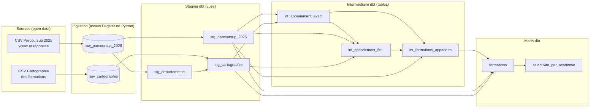
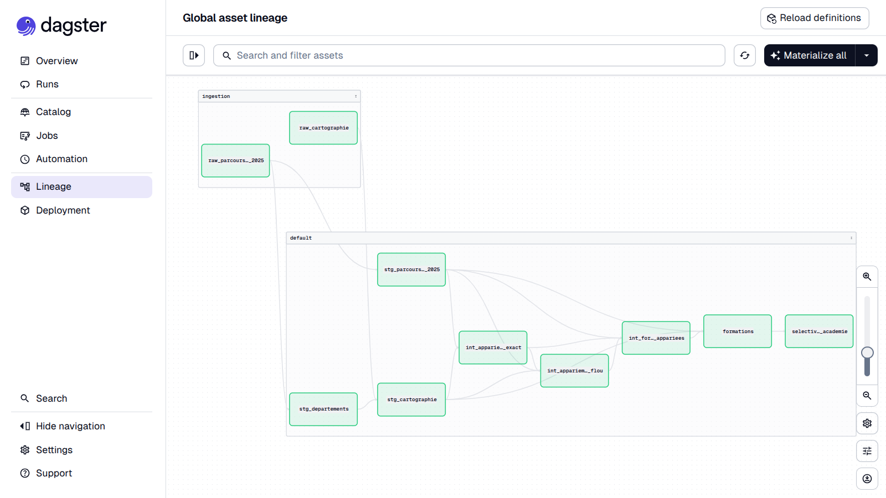

# Pipeline formations

Référentiel de formations post-bac construit à partir de deux jeux Parcoursup en open data, avec **DuckDB**, **dbt Core** et **Dagster**. Ceci est un projet personnel pour m'entraîner avec une certaine stack (DuckDB, dbt, Dagster) sur des données de formations en France.

Le pipeline télécharge les deux sources, rapproche leurs formations, calcule un taux d'admission et publie une table canonique `formations` (une ligne par formation) ainsi qu'une vue de sélectivité par académie. Des contrôles de qualité automatiques protègent chaque couche, et tout est orchestré par Dagster.

## En chiffres

|                                                     |                                             |
| --------------------------------------------------- | ------------------------------------------- |
| Formations avec statistiques de vœux (session 2025) | 14 252                                      |
| Lignes de la cartographie (sessions 2020 à 2026)    | 157 509                                     |
| Formations dans le référentiel final                | **25 865**                                  |
| Appariement exact (identifiant commun)              | 14 214 sur 14 252 (99,7 %)                  |
| Contrôles                                           | 28 tests dbt + 2 contrôles Python bloquants |
| Exécution complète du pipeline                      | environ 1 minute                            |

## Architecture



| Couche  | Rôle                                                                                                                                                   |
| ------- | ------------------------------------------------------------------------------------------------------------------------------------------------------ |
| `raw_*` | Copie fidèle des CSV dans DuckDB, sans nettoyage.                                                                                                      |
| `stg_*` | Un modèle par source : renommage, typage, nettoyage léger, aucune règle métier. `stg_departements` est un pont département → académie dérivé des vœux. |
| `int_*` | Résolution d'entités : jointure exacte, puis repli approximatif, puis table de correspondance.                                                         |
| marts   | `formations` (référentiel et taux d'admission) et `selectivite_par_academie` (vue agrégée).                                                            |



## Choix de conception et constats

- **Clé de jointure.** `cod_aff_form` (vœux) et `gta` (cartographie) désignent la même formation. Joindre sur l'établissement (UAI) multiplierait les lignes (14 252 formations pour 4 058 établissements) et les noms varient d'une source à l'autre. Il faut aussi joindre sur l'année : la cartographie garde l'historique, donc l'identifiant seul n'y est pas unique (la clé est le couple année et formation).
- **Repli approximatif.** Pour les 38 formations sans correspondance exacte : blocage par établissement, noms normalisés, similarité de Jaro-Winkler, seuil à 0,90. Les meilleurs candidats (scores de 0,92 à 0,96) étaient des formations **en apprentissage** au nom quasi identique. Or aucune des 14 214 formations appariées n'est en apprentissage : ces formations n'ont pas de statistiques de vœux. Les exclure par règle métier évite 7 faux rapprochements, et le repli ne rapproche finalement rien. Les 38 formations restent documentées comme non appariées.
- **Taux d'admission.** `100 × propositions / vœux` : la part des candidats à qui la formation a proposé une place. Le taux d'accès publié par Parcoursup est conservé à part, car aucune division simple ne le reproduit. Un taux **vide** signifie « pas de statistiques » (formations en apprentissage, surtout) ; un taux de **0** signifie qu'aucune proposition n'a été faite (43 formations).
- **Moyenne et taux global.** La vue par académie expose deux indicateurs qui ne racontent pas la même chose : la moyenne des taux des formations, et le total des propositions sur le total des vœux, qui pèse chaque formation selon sa taille.
- **Académie.** Les vœux donnent celle de l'établissement, la cartographie le lieu d'enseignement. Elles diffèrent pour 35 formations sur 14 214 (campus d'une université dans une autre académie). La règle retenue est documentée dans le modèle.

Exemple de résultat (vue `selectivite_par_academie`) :

| Académie   | Formations | Taux moyen par formation | Taux global |
| ---------- | ---------- | ------------------------ | ----------- |
| Mayotte    | 43         | 20,9 %                   | 15,3 %      |
| Paris      | 1 034      | 32,0 %                   | 18,1 %      |
| Toulouse   | 651        | 41,1 %                   | 28,2 %      |
| Strasbourg | 384        | 43,4 %                   | 35,2 %      |
| La Réunion | 246        | 47,2 %                   | 49,1 %      |

## Qualité des données

- **dbt (28 tests).** Unicité et non-nullité des clés, intégrité référentielle (`relationships`, dont « aucune formation des vœux n'est perdue avant le référentiel final »), valeurs acceptées pour la méthode d'appariement, et quatre tests singuliers dans [dbt/tests/](dbt/tests/) : clé composée de la cartographie, cohérence du taux, entonnoir acceptations ≤ propositions ≤ vœux, et un **avertissement** (non bloquant) sur les formations qui acceptent plus de candidats que leur capacité (anomalie connue de la source).
- **Python (2 contrôles bloquants).** Nombre minimal de lignes et colonnes clés présentes sur chaque table brute. S'ils échouent, les modèles dbt en aval ne s'exécutent pas.
- Les tests dbt remontent dans Dagster sous forme d'_asset checks_.

## Orchestration

Dagster décrit le pipeline en **assets** : deux assets Python d'ingestion, plus les 8 modèles dbt chargés via `dagster-dbt`, soit 10 assets et 30 contrôles dans un seul graphe, de la source jusqu'à la vue par académie. Le job `pipeline_complet` exécute le tout. DuckDB n'acceptant qu'un seul processus en écriture, l'exécuteur lance les étapes l'une après l'autre dans un seul processus.

## Lancer le projet

Prérequis : [uv](https://docs.astral.sh/uv/). Le premier lancement télécharge environ 100 Mo de données.

```bash
git clone https://github.com/Mariansza/Pipeline-formations.git
cd Pipeline-formations
uv sync
uv run dagster dev -m orchestration.definitions
```

Ouvrir http://127.0.0.1:3000, puis **Jobs**, **`pipeline_complet`** et lancer l'exécution. Les données arrivent dans `formations.duckdb`, qu'on peut interroger :

```bash
duckdb formations.duckdb -c "SELECT * FROM selectivite_par_academie;"
```

Pour travailler sur une seule académie pendant le développement, avec dbt seul (depuis `dbt/`) : `uv run dbt build --vars '{academie: Strasbourg}'`. Par défaut, toutes les académies sont traitées.

## Structure du dépôt

```
dbt/                  projet dbt (modèles raw/stg/int/marts, tests, profil)
  models/staging/
  models/intermediate/
  models/marts/
  tests/              tests singuliers
orchestration/        projet Dagster (assets d'ingestion, assets dbt, job)
```

## Sources

- [Cartographie des formations Parcoursup](https://www.data.gouv.fr/datasets/cartographie-des-formations-parcoursup) (sessions 2020 à 2026)
- [Parcoursup 2025 : vœux et réponses des établissements](https://www.data.gouv.fr/datasets/parcoursup-2025-voeux-de-poursuite-detudes-et-de-reorientation-dans-lenseignement-superieur-et-reponses-des-etablissements-1)
